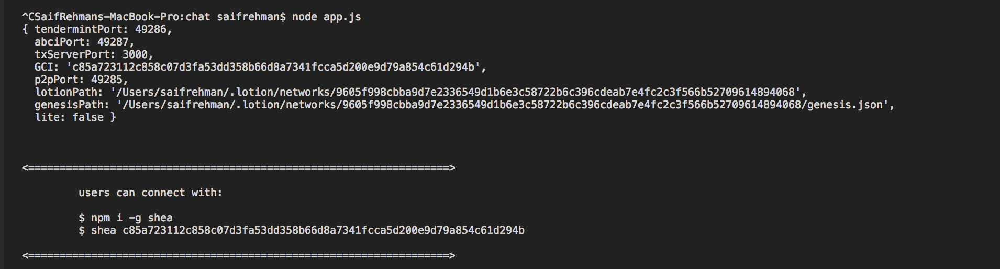
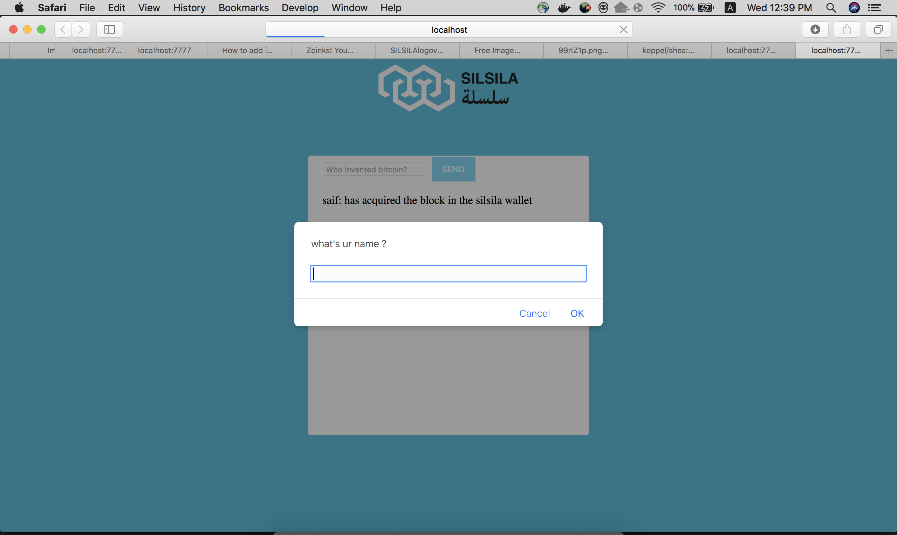
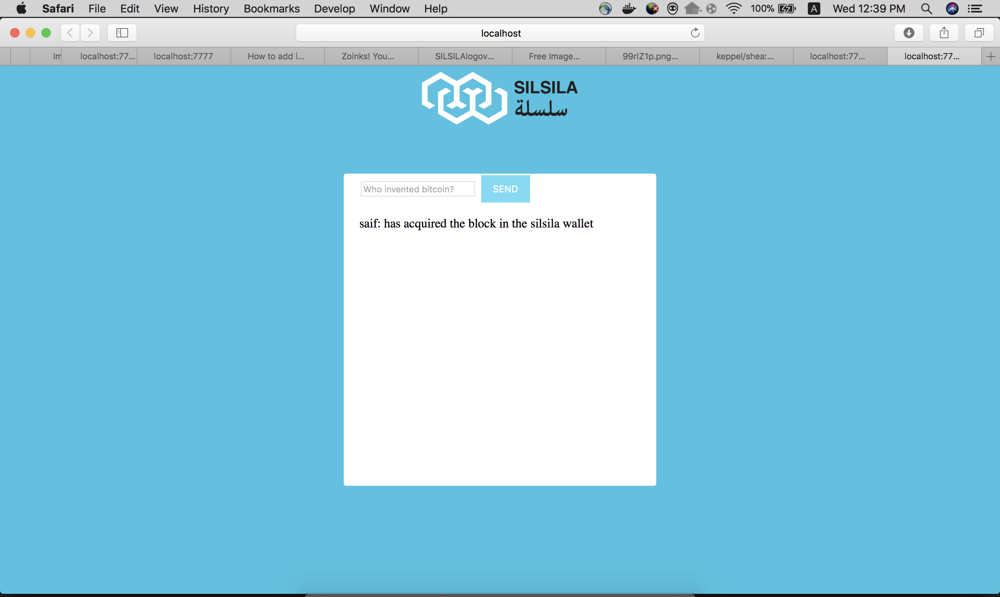

# Tendermint


Blockchain app baesd on tendermint. The app logs the sucessull answer given by user 

## Technologies used
1. Tendermint concensys
2. Shea
3. Lotionjs

## Usuage 
1. Install dependencies 
```
$ npm i
``` 

2. Install shea to connect to blockchain
```
$ npm i -g shea
```

3. RUN the app
```
$ node app.js
```

4. connect to blockchain

```
$ shea <GCI>
```

## App screenshots





## TO be done 
Uploading to IBM Cloud as a Cloud Foundry App